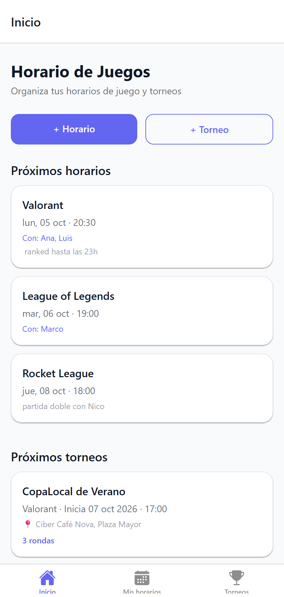
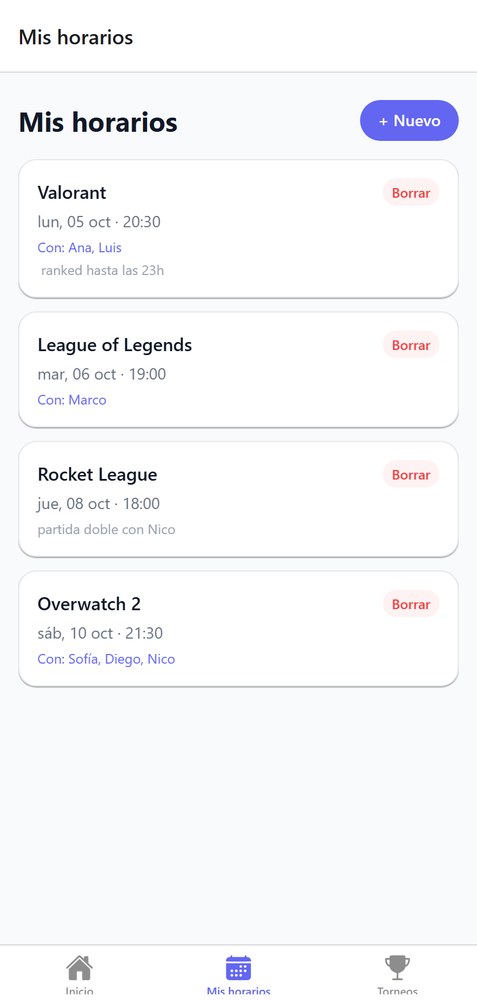
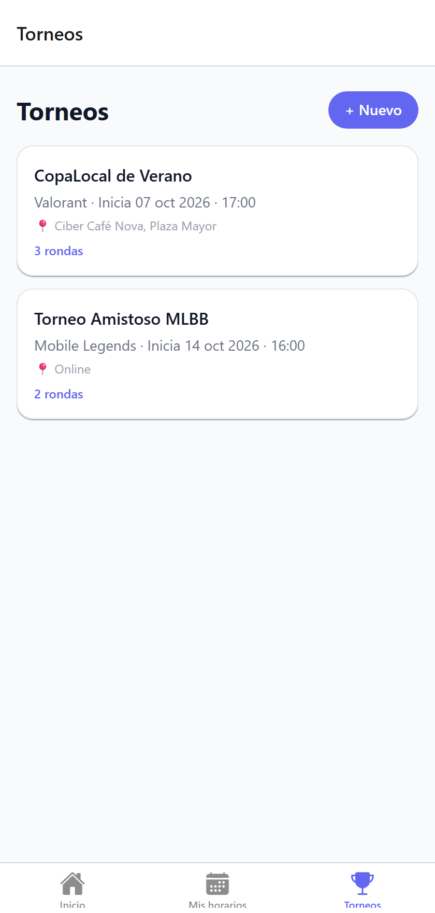
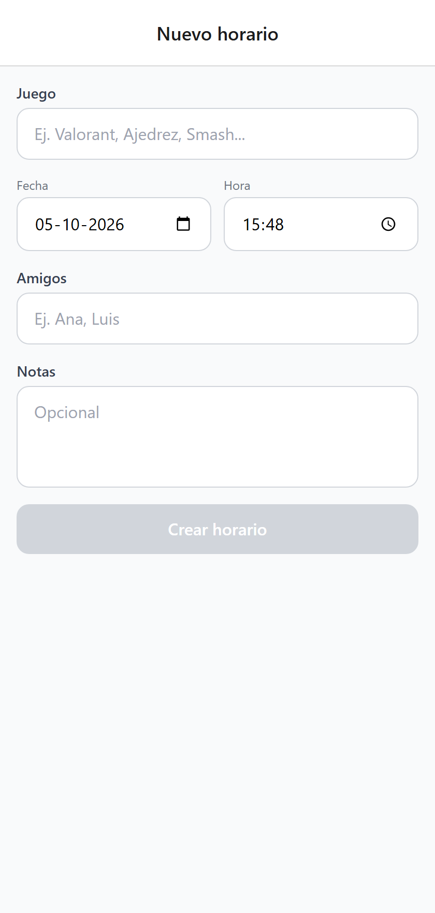
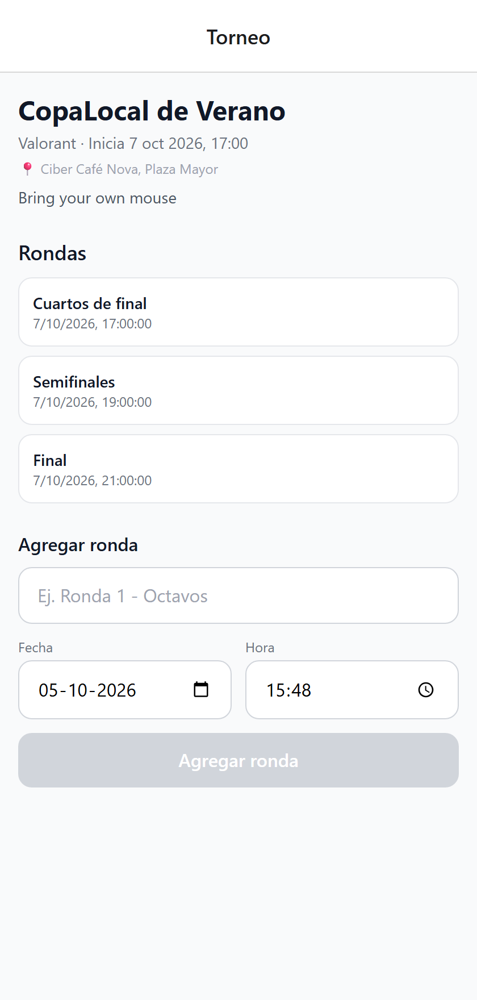

<div align="center">


# game-schedule

**Horarios y torneos**

App en React Native + Expo para organizar tus horarios de juego y torneos: anota cuándo vas a jugar, con quién, y lleva el registro de las rondas de tus torneos.

</div>

## Vista previa

<table>
  <tr>
    <td align="center"><br /><sub>Inicio</sub></td>
    <td align="center"><br /><sub>Mis horarios</sub></td>
    <td align="center"><br /><sub>Torneos</sub></td>
  </tr>
  <tr>
    <td align="center"><br /><sub>Nuevo horario</sub></td>
    <td align="center"><br /><sub>Detalle de torneo</sub></td>
    <td align="center"></td>
  </tr>
</table>

## Stack

- Expo SDK 57 + Expo Router (rutas en `src/app`)
- NativeWind (Tailwind CSS para React Native)
- AsyncStorage para persistencia local (sin backend por ahora)

## Empezar

```sh
npm install
npx expo start
```

## Estructura

```
src/
  app/          # rutas (Expo Router)
  components/   # componentes UI reutilizables
  hooks/        # useSchedules, useTournaments
  models/       # tipos de datos
  storage/      # capa de persistencia (AsyncStorage)
  utils/        # utilidades varias
```

## Las notificaciones fallan en Expo Go principalmente porque Expo eliminó el soporte del módulo expo-notifications dentro de la app estándar de Expo Go a partir de SDK 53.
